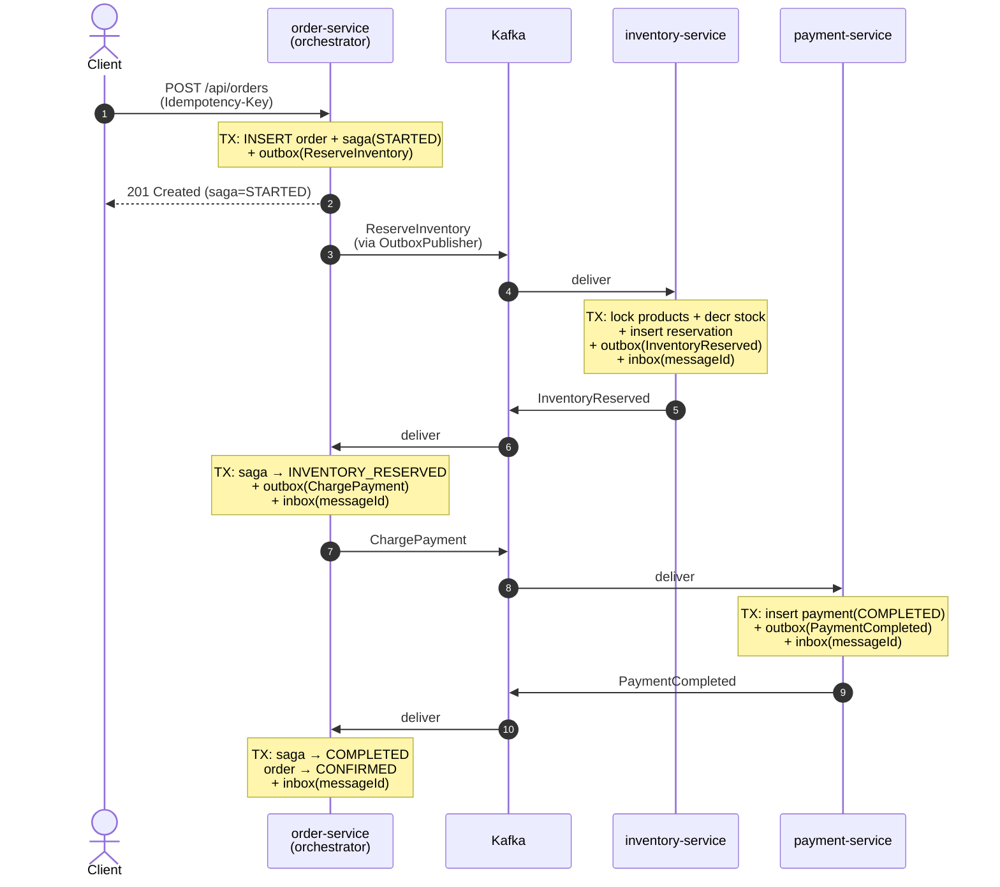
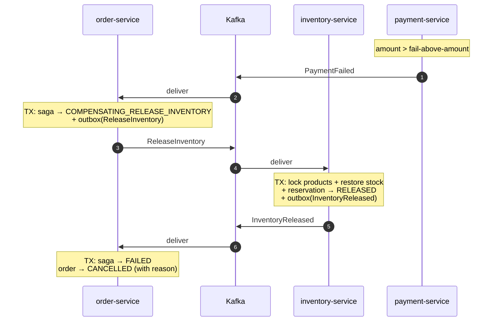
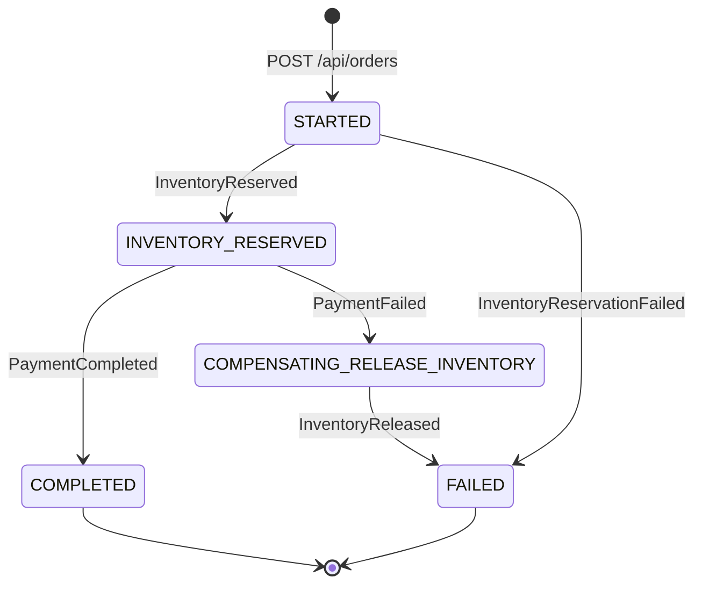

# Saga Demo — Orchestration with Outbox / Inbox / Idempotency

A small but production-flavoured demo of the **Saga pattern (orchestration variant)**
across three Spring Boot services backed by Kafka and Postgres. Built to show:

- Atomic state change + reliable event publication via the **Transactional Outbox** pattern
- Consumer-side dedup via the **Inbox** pattern
- HTTP-level idempotency via an `Idempotency-Key` header
- A central **orchestrator** that drives the saga state machine and triggers compensating actions on failure

A separate `ui-service` (BFF) renders a dashboard via Thymeleaf + HTMX, calling the
`order-service` and `inventory-service` REST APIs over HTTP — frontend is fully
decoupled from the saga participants.

---

## Architecture

```
                        +---------------------+
                        |     ui-service      |   :8080
                        |  Thymeleaf + HTMX   |
                        +----------+----------+
                         REST       |       REST
                         (orders)   |       (products)
                                    v
   +-----------------+        +----+----------+        +--------------------+
   |  Browser / curl | -----> | order-service |        | inventory-service  |
   +-----------------+  REST  |   :8081       |        |   :8083            |
                              |  ORCHESTRATOR |        |  PARTICIPANT       |
                              +---+-------+---+        +----+----------+----+
                                  | outbox |                | outbox  | inbox
                                  v        ^                v         ^
                          +-------+--------+----------------+---------+------+
                          |                       Kafka                       |
                          |  inventory.commands  inventory.events             |
                          |  payment.commands    payment.events               |
                          +-----+----------+----------------------------------+
                                |          ^
                          inbox |          | outbox
                                v          |
                              +------------+--------+
                              |   payment-service   |   :8082
                              |   PARTICIPANT       |
                              +---------------------+

   Postgres (single instance, 3 schemas):
     order_db.{orders, saga_instances, outbox_events, inbox_messages, idempotency_keys, order_items}
     payment_db.{payments, outbox_events, inbox_messages}
     inventory_db.{products, reservations, reservation_items, outbox_events, inbox_messages}
```

### Happy path



### Compensating path (payment fails)



---

## Why orchestration (and not choreography)?

This was a deliberate choice for the demo's business case (time-windowed sales,
strict ordering of steps, central observability requirement).

|                                | **Orchestration** (this repo)                                                                 | **Choreography**                                                                                       |
| ------------------------------ | --------------------------------------------------------------------------------------------- | ------------------------------------------------------------------------------------------------------ |
| Where the state machine lives  | Central orchestrator (`SagaOrchestrator` in order-service)                                    | Spread across services — each service reacts to events and emits the next event                        |
| Adding a new step              | Edit one class                                                                                | Edit several services + their event contracts                                                          |
| Observability                  | Easy — one `saga_instances` row tells you the current step                                    | Hard — you have to trace events across services to reconstruct state                                   |
| Risk of cycles / lost events   | Low — orchestrator decides what comes next                                                    | Higher — accidental event loops are easy to introduce                                                  |
| Coupling                       | Participants are dumb (only know their own job)                                               | Participants must know which downstream event to emit                                                  |
| Single point of failure        | Orchestrator. Mitigation: store state in DB, restart-safe                                     | None — but harder to debug because no one "owns" the flow                                              |
| Fits this domain?              | **Yes**. Orders inside time-windowed sales need centralised control of step order             | Worse fit — decentralised flow makes flash-sale cut-offs harder to enforce                              |

In interviews, the wrong answer is "X is always better." The right answer is:
*orchestration when the business needs centralised control / observability;
choreography when participants are truly independent and the workflow rarely changes.*

---

## Three patterns, three problems they solve

### 1. Transactional Outbox

**Problem.** A service needs to atomically (a) update its DB and (b) publish a
Kafka message. There's no distributed transaction across Postgres + Kafka, so a
naive `repository.save(); kafka.send();` can leave the system in either of two
broken states:

- DB commit succeeds, Kafka publish fails → downstream never knows about the change
- DB commit fails, Kafka publish succeeded → downstream acts on a change that didn't happen

**Solution.** In the same DB transaction as the business change, insert a row
into a local `outbox_events` table. A scheduled `OutboxPublisher` polls
unpublished rows and pushes them to Kafka, marking them sent. Either both
commit together, or neither — and any temporary Kafka outage just delays
delivery instead of losing the event.

See: `OutboxRecorder.java`, `OutboxPublisher.java` in each service.

### 2. Inbox (consumer-side dedup)

**Problem.** Kafka guarantees at-least-once delivery. A consumer may see the
same `messageId` twice (rebalance, redelivery after crash, outbox republish on
retry). Applying business effects twice is unacceptable for charges /
reservations.

**Solution.** Each consumer has an `inbox_messages` table keyed on `messageId`.
Inside the same transaction as the business change, we insert into inbox. On a
duplicate, the PK conflict tells us to skip. Result: **exactly-once effective**
processing without distributed transactions.

See: `InboxGuard.java` in each service.

### 3. HTTP idempotency key

**Problem.** A client retries `POST /api/orders` because the network blipped.
Without protection, we'd create two identical orders and run two sagas.

**Solution.** Client sends `Idempotency-Key: <uuid>` header. order-service
checks `idempotency_keys` table; on hit, returns the existing order id without
side effects.

See: `OrderService.createOrder` in `order-service`.

### 4. Consumer retry + Dead-Letter Topics

**Problem.** Transient failures happen all the time: the DB is briefly
unavailable, a downstream is slow, a Kafka rebalance hits mid-handler. Without
a retry policy, the listener re-throws and Kafka redelivers forever — pinning
the partition and blocking every subsequent message.

**Solution.** Each service registers a `DefaultErrorHandler` wired to a
`DeadLetterPublishingRecoverer`:

- **5 total attempts** per record (1 original + 4 retries) with a **1-second
  back-off** between attempts
- On the 5th failure, the record is published to `<topic>.DLT` (Spring's
  default Dead Letter Topic naming) and the offset is committed so the
  partition moves on
- `IllegalArgumentException`, `IllegalStateException`, and `JsonProcessingException`
  are **not retried** — they're programming or data errors that won't fix
  themselves, so we fail fast straight to DLT

**Interaction with the Inbox.** Because the inbox-row insert and the business
effect commit together inside the listener's `@Transactional` boundary, a
failed attempt rolls back BOTH — leaving the inbox empty for that messageId.
The next retry therefore proceeds as a genuine first attempt, not a duplicate.

**DLT topics created automatically** (Kafka auto-create is on):
- `inventory.commands.DLT`, `inventory.events.DLT`
- `payment.commands.DLT`, `payment.events.DLT`

**Operating the DLT.** Inspect failed records in Kafdrop
(<http://localhost:9000>) — Spring adds headers like
`kafka_dlt-exception-fqcn`, `kafka_dlt-exception-message`, and
`kafka_dlt-original-offset` to every DLT record so you can triage without
reaching for logs. A real deployment pairs this with an alert ("DLT > 0
records in last 5 min") and a small replay tool.

See: `KafkaErrorHandlerConfig.java` in each of order-service / payment-service /
inventory-service.

---

## State machine (orchestrator)



Defined in `SagaState.java` and enforced by `SagaOrchestrator.java`.

---

## Running locally

### Prerequisites

- JDK 21
- Maven 3.9+
- Docker + Docker Compose

### 1. Infra

```bash
docker compose up -d
```

This starts Postgres (with the three schemas pre-created), Kafka, Zookeeper,
and Kafdrop (Kafka UI at <http://localhost:9000>).

### 2. Build all modules

```bash
mvn clean install
```

### 3. Start the services (each in its own terminal)

```bash
mvn -pl order-service spring-boot:run
mvn -pl payment-service spring-boot:run
mvn -pl inventory-service spring-boot:run
mvn -pl ui-service spring-boot:run
```

Flyway runs on first boot of each service and creates its tables in its
dedicated schema.

### 4. Open the dashboard

<http://localhost:8080>

- Pick a product, set quantity + unit price, click **Place order**.
- You'll be redirected to the order detail page; the status panel auto-refreshes
  via HTMX every second.
- Set **unit price × quantity > 5000** to force payment failure and watch the
  compensating release run end-to-end.

### REST quickref

```bash
# Create order (happy path)
curl -X POST http://localhost:8081/api/orders \
  -H "Content-Type: application/json" \
  -H "Idempotency-Key: $(uuidgen)" \
  -d '{
    "customerId": "00000000-0000-0000-0000-000000000001",
    "items": [
      {"productId": "11111111-1111-1111-1111-111111111111", "quantity": 2, "unitPrice": 100.00}
    ]
  }'

# Inspect order + saga state
curl http://localhost:8081/api/orders/<orderId> | jq

# List products (with reserved counts)
curl http://localhost:8083/api/products | jq
```

OpenAPI / Swagger UI for order-service: <http://localhost:8081/swagger-ui.html>

---

## Code map

```
saga-demo/
├── docker-compose.yml           Postgres + Kafka + Zookeeper + Kafdrop
├── docker/postgres/init.sql     creates order_db / payment_db / inventory_db schemas
├── common/                      shared event payloads + envelope + topic constants
│   └── src/main/java/com/quanla/sagademo/common/
│       ├── Topics.java
│       └── event/
│           ├── EventEnvelope.java
│           ├── EventTypes.java
│           └── payload/         records for each command / event
├── order-service/               orchestrator + REST + idempotency
│   └── src/main/java/com/quanla/sagademo/order/
│       ├── api/                 REST controllers + DTOs
│       ├── domain/              Order, OrderItem, SagaInstance, IdempotencyKey
│       ├── saga/                OrderService, SagaOrchestrator, SagaEventListener
│       ├── outbox/              entity + repo + recorder + scheduled publisher
│       └── inbox/               entity + repo + guard
├── payment-service/             charge / refund participant
├── inventory-service/           reserve / release participant (pessimistic-lock stock)
└── ui-service/                  Thymeleaf + HTMX dashboard, calls order-service via REST
```

---

## What the demo does NOT cover (intentional scope)

- No Saga timeout / stuck-saga detector — production systems run a scheduled job
  to surface sagas that stayed in a non-terminal state past their SLA.
- No DLT replay tool. DLT records carry enough headers to manually re-publish
  to the original topic via Kafdrop / kcat, but a real deployment ships a small
  replay endpoint with a "fix-and-retry" workflow.
- No CDC-based outbox publishing (Debezium). The polling approach was chosen
  for clarity; CDC is the production-grade alternative.
- No authentication / multi-tenancy.
- Single Postgres instance with three schemas (not three separate clusters).
  This still gives each service its own DDL/data, but in production each service
  would own its own database cluster.
